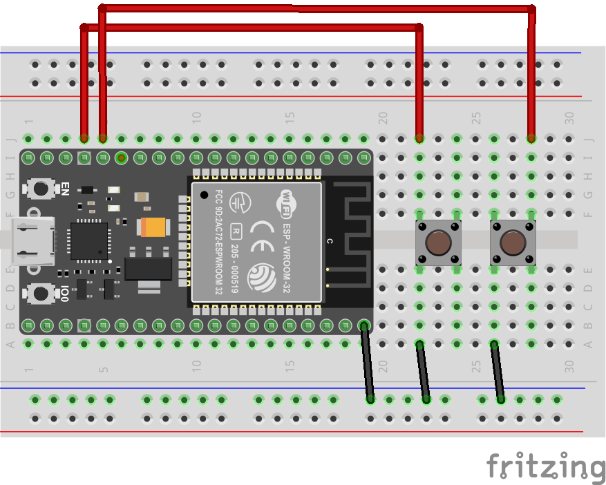
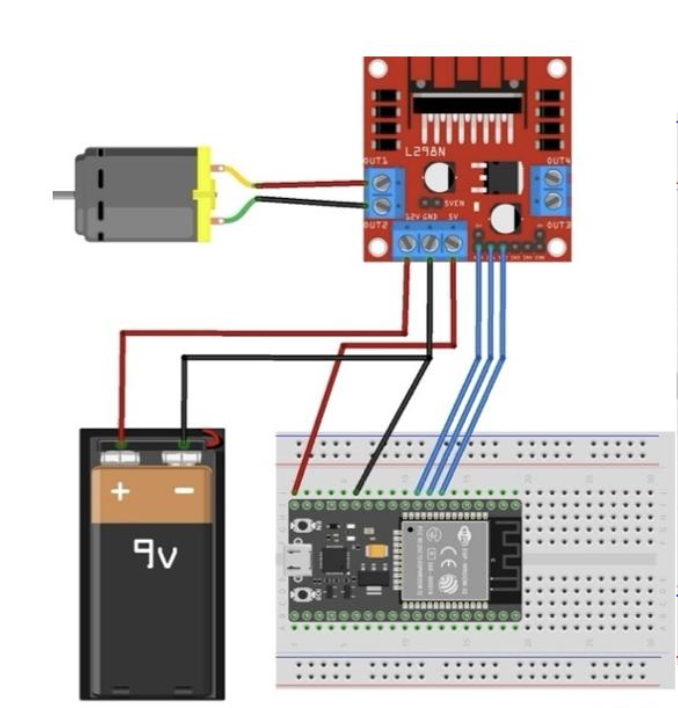

# QuAC ESP32 Control System

Embedded control software and electronics for **QuAC (Quick Aorta Compressor)**, a motorised external-compression prototype developed as part of **TMM4121 – Product Development** at NTNU.

> **Educational prototype:** QuAC was developed as a student product-development project. It is not a certified medical device and is not intended for clinical use.

QuAC was developed by a thirteen-person Mechanical Engineering student team. My responsibilities were within **mechatronics and programming**, shared with one other team member, and included ESP32 implementation, ESP-NOW communication, motor-control logic, electronics integration, testing, and troubleshooting.

This repository documents the software and electronics portion of the project. The mechanical design, CAD development, manufacturing, structural analysis, and wider product-development process are documented separately in the project case study on my portfolio website.

<p align="center">
  
  <br>
  <em>Final QuAC prototype.</em>
</p>

---

## Overview

QuAC uses a motor-driven linear actuator to move a compression arm. The mechanism is controlled through a wireless handheld remote, allowing the operator to control the actuator without a wired connection to the main unit.

The embedded system uses two ESP32 development boards:

- **Remote controller** — reads two push buttons and transmits movement commands.
- **Actuator controller** — receives commands and controls a 12 V DC gearmotor through an L298N motor driver.

The two ESP32 boards communicate directly using **ESP-NOW**.

### Key Features

- Wireless control using two ESP32 boards
- Direct ESP-NOW communication
- Separate remote-controller and actuator-controller firmware
- Bidirectional DC motor control
- Upward and downward actuator movement
- Motor stop when neither button is pressed
- Battery-powered remote and actuator units
- Electronics integrated into the completed prototype

The main control flow is:

```text
Push buttons
    ↓
Remote ESP32
    ↓ ESP-NOW
Actuator ESP32
    ↓
L298N motor driver
    ↓
12 V DC gearmotor
    ↓
Linear actuator movement
```

---

## Electronics and Wiring

<p align="center">
  
  <br>
  <em>Assembled electronics used for wireless communication and actuator control.</em>
</p>

| Component | Function |
|---|---|
| ESP32, remote unit | Reads button inputs and transmits commands through ESP-NOW |
| ESP32, actuator unit | Receives commands and controls the motor driver |
| Two push buttons | Command upward and downward actuator movement |
| L298N dual H-bridge | Provides bidirectional control of the DC motor |
| 12 V DC gearmotor | Drives the leadscrew-based actuator |
| Battery pack | Powers the motor and motor driver |
| Power bank | Powers the ESP32 control electronics |

### Remote Controller

<p align="center">
  
  <br>
  <em>Wiring diagram for the handheld ESP32 remote controller.</em>
</p>

The remote ESP32 reads the two button inputs and converts them into one of three movement commands:

```text
UP
DOWN
STOP
```

The selected command is transmitted wirelessly to the actuator controller using ESP-NOW.

### Actuator Controller

<p align="center">
  
  <br>
  <em>Wiring diagram for the ESP32, L298N motor driver, and DC motor.</em>
</p>

The actuator ESP32 receives the movement command and sets the L298N direction inputs accordingly.

| Command | IN1 | IN2 | Result |
|---|---:|---:|---|
| Move down | HIGH | LOW | Motor rotates forward |
| Move up | LOW | HIGH | Motor rotates in reverse |
| Stop | LOW | LOW | Motor stops |

The physical direction depends on the motor wiring and can be reversed in software if required.

---

## Wireless Communication

The two ESP32 boards communicate using **ESP-NOW**, a direct wireless communication protocol supported by the ESP32.

ESP-NOW was suitable for the prototype because it allows short commands to be sent directly between two known devices without requiring a router or external Wi-Fi network.

The communication system was developed incrementally:

1. Test values were transmitted between the ESP32 boards.
2. The received values were verified through serial output.
3. The remote buttons were connected to the transmitted data.
4. The received commands were connected to the motor-control logic.
5. The complete wireless system was tested with the actuator.

The report documents that the mechatronics subgroup developed the system from basic button and LED tests to wireless motor control using two ESP32 units. PRODUKTUTVIKLING.pdf

---

## Software and Control Flow

The repository contains two separate firmware programs because the ESP32 boards perform different roles.

### Remote-Controller Logic

<p align="center">
  
  <br>
  <em>Remote-controller logic for reading button inputs and transmitting movement commands.</em>
</p>

The remote-controller firmware:

- Initialises ESP-NOW
- Registers the actuator ESP32 as a communication peer
- Reads the upward and downward buttons
- Encodes the selected movement command
- Transmits the command
- Sends a stop command when no button is pressed

### Actuator-Controller Logic

<p align="center">
  
  <br>
  <em>Actuator-controller logic for receiving commands and controlling motor direction.</em>
</p>

The actuator-controller firmware:

- Initialises ESP-NOW as a receiver
- Receives movement commands
- Decodes the received command
- Sets the L298N direction inputs
- Drives the motor upward or downward
- Stops the motor when no movement command is active

---

## Motor and Actuator Control

The actuator is driven by a 12 V DC gearmotor.

The motor rotates a leadscrew through a gear transmission. Rotation of the leadscrew moves a nut along the screw, converting rotational motion into linear movement of the compression arm.

The leadscrew mechanism was selected because it provides:

- High mechanical advantage
- Controlled linear movement
- Resistance to back-driving
- The ability to maintain pressure when the motor is not actively rotating

The GitHub repository focuses only on the electronic and software control of this mechanism. The detailed mechanical design and manufacturing process are presented in the portfolio case study.

---

## Repository Structure

```text
quac-esp32-control/
├── documentation/
│   ├── actuator-activity-diagram.png
│   ├── actuator-wiring-diagram.png
│   ├── remote-activity-diagram.png
│   └── remote-wiring-diagram.png
├── images/
│   ├── electronics-prototype.jpg
│   └── final-prototype.jpg
├── software/
│   ├── actuator-controller/
│   │   └── actuator-controller.ino
│   └── remote-controller/
│       └── remote-controller.ino
└── README.md
```

- `documentation/` contains the activity and wiring diagrams for both ESP32 units.
- `images/` contains photographs of the electronics and completed prototype.
- `software/remote-controller/` contains the firmware for the handheld remote.
- `software/actuator-controller/` contains the firmware for the motor-control unit.

---

## Setup

The project requires:

- Two ESP32 development boards
- Arduino IDE or another compatible ESP32 development environment
- ESP32 Arduino board package
- ESP-NOW support included with the ESP32 framework

### 1. Configure the Receiver Address

The remote controller must contain the MAC address of the actuator ESP32.

Replace the placeholder in the remote-controller firmware:

```cpp
uint8_t receiverAddress[] = {
    0xXX, 0xXX, 0xXX, 0xXX, 0xXX, 0xXX
};
```

### 2. Upload the Actuator Firmware

Open:

```text
software/actuator-controller/actuator-controller.ino
```

Select the correct ESP32 board and serial port, then compile and upload the firmware.

### 3. Upload the Remote Firmware

Open:

```text
software/remote-controller/remote-controller.ino
```

Select the second ESP32 board and serial port, then compile and upload the firmware.

### 4. Test the Electronics

Before connecting the motor to a loaded mechanism:

1. Confirm that the motor remains stopped when neither button is pressed.
2. Test the upward command.
3. Test the downward command.
4. Confirm that the motor direction matches the intended actuator movement.
5. Confirm that the motor stops when the button is released.
6. Test the system with the actuator unloaded before applying mechanical load.

---

## Testing

The electronics were developed and tested incrementally before integration into the completed prototype.

Testing included:

- Push-button input
- ESP-NOW communication
- Transmission of test values
- Motor direction
- Motor-driver response
- Wireless remote operation
- Integration with the linear actuator
- Full-system testing under mechanical load

The L298N motor driver produced significant heat during testing. It was therefore mounted on 3D-printed standoffs to improve airflow and reduce direct contact with the baseplate.

A potentiometer was originally included for variable speed control. It was removed after failing late in the development process and was not required for the prototype's basic operation.

A force sensor was also considered but not implemented because of sensor capacity, packaging, wiring, and integration constraints within the project timeframe. PRODUKTUTVIKLING.pdf

During full-system testing, the complete prototype produced a measured compression force of **45.8 kg**, exceeding the engineering target of 40 kg. This was a prototype load test and not a clinical validation. PRODUKTUTVIKLING.pdf

---

## Known Limitations and Next Steps

- No dedicated fail-safe automatically stops the motor if ESP-NOW communication is lost.
- No limit switches prevent excessive actuator travel.
- The L298N motor driver produces significant heat during sustained operation.
- The ESP32 electronics and motor use separate power sources.
- The system uses open-loop direction control without force feedback.
- The prototype does not include a dedicated hardware emergency stop.

Natural next steps include:

- Adding upper and lower limit switches
- Implementing communication-loss fail-safe behaviour
- Adding a hardware emergency stop
- Replacing the L298N with a more efficient motor driver
- Using a regulated power system for the motor and control electronics
- Adding calibrated force sensing
- Implementing closed-loop force control

---

## Contributions

The complete QuAC prototype was developed by a thirteen-person Mechanical Engineering student team at NTNU.

The mechatronics sub-team consisted of **Mohamed Elwalid Fadul** and **Hardik Deshpande**. The sub-team was responsible for the electronic components, firmware, testing, and integration of the mechatronic system into the physical prototype. PRODUKTUTVIKLING.pdf

My main contributions included:

- ESP32 implementation
- ESP-NOW communication
- Remote-controller firmware
- Motor-control logic
- Electronics wiring
- Component testing
- Integration with the linear actuator
- Full-system troubleshooting
